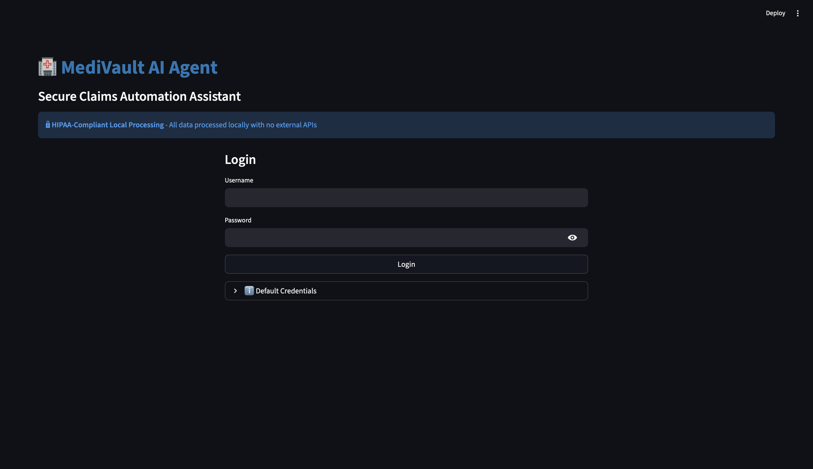

# Medvault-AI-Agent

A lightweight assistant for processing medical records with local LLMs and OCR.

This repository contains the Medvault AI Agent — a small Streamlit-based app and supporting libraries to extract information from medical documents (PDFs/images), suggest ICD/CPT codes using a local LLM runtime (Ollama), and generate CMS-1500-like outputs for downstream workflows.




## Highlights

- Local-first LLM integration (Ollama) — supports `llama3.2` model.
- OCR pipeline (Tesseract or PAC-OCR) to extract text from PDFs and images.
- Medical code suggestion and simple CMS-1500 generation utilities.
- Streamlit UI for quick uploads and reviewing extraction + coding suggestions.

## Quick start (macOS / zsh)

Prerequisites:

- Python 3.10+
- Git
- Ollama (optional but recommended for LLM features)
- Tesseract OCR (optional for better OCR on scanned docs)

Install system deps (macOS example):

```bash
# Xcode command line tools (if needed for compiling wheels)
xcode-select --install

# Homebrew (if you use it) and tesseract
brew install tesseract || true
```

Python environment and dependencies:

```bash
cd /Users/dhruvrathee/Desktop/Medvault-AI-Agent
python3 -m venv .venv
source .venv/bin/activate
pip install --upgrade pip setuptools wheel
pip install -r requirements.txt
```

Environment variables

Create a `.env` file in the repo root (example):

```env
# Example .env
OLLAMA_URL=http://localhost:11434
ENCRYPTION_KEY=replace-with-a-secure-key
```

Run the Streamlit app:

```bash
source .venv/bin/activate
streamlit run src/app.py
```

Open http://localhost:8501 in your browser.

## Tests

Run unit tests with pytest:

```bash
source .venv/bin/activate
pytest -q
```

## Troubleshooting

- Merge conflicts when pulling: If Git reports unmerged files, resolve conflict markers (`<<<<<<<`, `=======`, `>>>>>>>`) and commit the resolution.
- Ollama connection issues: Ensure `OLLAMA_URL` points to a running Ollama server and the required model (e.g., `llama3.2`) is installed.
- OCR issues: If Tesseract output is poor, try installing language packs or using higher-quality scans.

## Contributing

1. Fork the repo, create a feature branch, and open a pull request.
2. Keep changes small and include tests where applicable.

## License

See the top-level `LICENSE` file for license terms.

